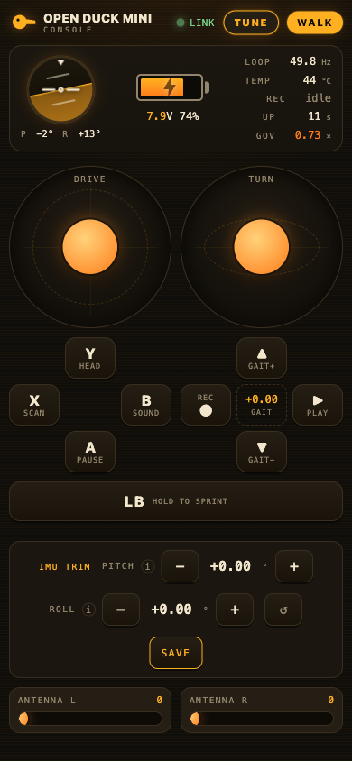
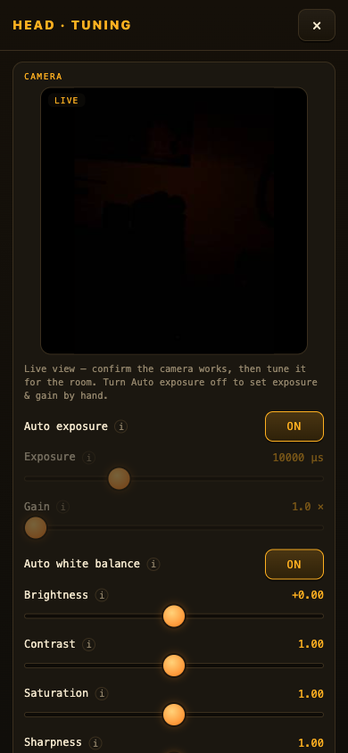
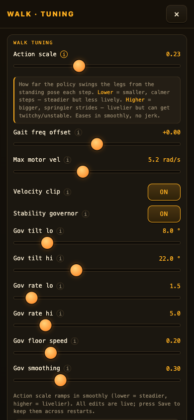
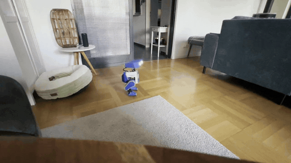

<h1 align="center">🦆⚡ Open Duck Supercharged v2.5</h1>

<p align="center">
  <b>On-robot runtime for the Open Duck Mini — now with rock-solid walking,<br>
  a phone control console, live tuning, and a stack of quality-of-life features.</b>
</p>

<p align="center">
  <i>A supercharged fork of</i>
  <a href="https://github.com/apirrone/Open_Duck_Mini_Runtime"><b>apirrone/Open_Duck_Mini_Runtime</b></a>
  <i>(branch <code>v2</code>).</i>
</p>

<p align="center">
  
  
  
</p>

---

## ⚡ Recommended: start from the pre-built image

The easiest way to a running duck: **flash the ready-made SD-card image** from the
[**Releases**](../../releases) section instead of installing anything by hand. The whole
Supercharged stack — runtime, dependencies, the trained walk policy, the phone console,
foot-switch autostart, and the duck's own `Openduck` Wi-Fi hotspot — comes
pre-installed. You only flash, boot, and run the guided first-time setup.

👉 **[Pre-built image — install & first-boot guide](docs/ISO_INSTALL.md)** — flashing,
Wi-Fi & SSH access (hotspot password included), the foot-switch autostart, and first
configuration.

---

## What is this?

The **Open Duck Mini** is a small BDX-style bipedal "duck" robot. This repository is the
**runtime that lives on the robot's Raspberry Pi**: it runs a single imitation-RL
locomotion policy (exported to ONNX) at 50 Hz, driving 14 Feetech serial-bus servos,
with an Xbox gamepad for teleop and optional expression peripherals (camera, speaker,
antennas, projector, eyes).

The upstream project makes the duck **walk**. **Supercharged v2.5** makes it walk
*steadily*, and wraps the whole thing in a phone-first, newcomer-friendly experience.
👉 **Full change log: [docs/WHATS_NEW.md](docs/WHATS_NEW.md).**

---

## 🎥 See it walk

The proof is in the walking — here's a Supercharged duck crossing a real room end-to-end:
steadier balance and a calmer, planted gait, no tip-overs.

<p align="center">
  <a href="docs/videos/walk-demo.mp4">
    
  </a>
</p>

<p align="center">
  ▶️ <b><a href="docs/videos/walk-demo.mp4">Full 77-second demo (with sound)</a></b>
  &nbsp;·&nbsp; the stability work (action-scale, velocity clip, tilt governor, IMU trim) in action.
</p>

---

## ✨ Highlights

- 🦿 **Rock-solid walking** — config-gated stability levers (action-scale, velocity
  clip, a near-fall **stability governor**, cadence tuning), real **IMU mounting-trim**
  correction, and **fall-detection auto-pause**.
- 📱 **Phone control console** — a self-contained, dependency-free Web UI served off the
  robot. Join the duck's Wi-Fi and it **pops up automatically** (captive portal). Live
  attitude horizon, battery, twin joysticks, every button.
- 🎛️ **Live tuning from your phone** — sliders for every walk / camera / antenna
  parameter, with **ⓘ tap-to-explain hints** and **↺ reset-to-known-good-defaults** on
  each section. Nothing persists until you press Save.
- 🔋 **Battery % that actually works** — read from the servos via a safe bus handoff
  (the Pi has no voltage sensor).
- 📷 **Live camera view + tuning** — see the feed on your phone, dial in exposure/gain/
  white-balance for the room.
- 🙂 **Expression** — face tracking with greet/scan/farewell, **jitter-free antennas**
  (pigpio) with switchable organic "free animation", walk/head **record & playback**,
  scanner sounds + a droid-voice generator.
- 🛠️ **Painless bring-up** — a one-command guided **`first_time_setup.py`** wizard,
  a one-file deploy (`mac_transfer.command` on macOS/Linux, `windows_transfer.ps1` on
  Windows), and one-time **ops kits** (pigpio, captive-portal, Xbox auto-reconnect).

---

## 📱 The console

<table>
<tr>
<td width="50%" valign="top">

**Walk mode** — attitude horizon, battery, loop-rate/temperature, twin sticks (drive +
turn), gait & sprint, record/playback, and an **IMU-trim** card.

</td>
<td width="50%" valign="top">

**Head-puppet mode** — puppet the head with the sticks, toggle **face-tracking**, and
open **TUNE** for the **live camera view** + camera settings and the antenna controls.

</td>
</tr>
</table>

No app, no internet, no pairing: a stdlib HTTP server on the robot serves one
self-contained page. Preview it on your laptop with **no robot** via
`mini_bdx_runtime/mini_bdx_runtime/webui/mock_server.py`.

---

## 🚀 Quick start

> First time on a fresh Pi? Do the **[base hardware setup](docs/BASE_SETUP.md)** once
> (OS, I2C, speaker, virtualenv, `pip install -e .`).

**Guided bring-up (recommended):**

```bash
cd Open_Duck_Mini_Runtime
python scripts/first_time_setup.py     # skippable, resumable wizard: motors, offsets,
                                       # IMU calibrate+trim, walk tuning, features, ops
```

**Run the walk** (download the [policy checkpoint](https://github.com/apirrone/Open_Duck_Mini/blob/v2/BEST_WALK_ONNX_2.onnx) first):

```bash
cd scripts
python v2_rl_walk_mujoco.py --onnx_model_path <path>/BEST_WALK_ONNX_2.onnx
```

**Head-puppet + camera:**

```bash
cd scripts && python head_puppet.py
```

**Then grab your phone:** join the duck's **Wi-Fi** → the console pops up (or browse to
`http://10.42.0.1:8080/`). Tap **TUNE** to tune live.

**Seed the known-good walk tuning** on a new duck (then re-calibrate per robot):

```bash
python scripts/apply_stability_defaults.py
```

---

## 🎮 Controls

**Gamepad** — `A` pause/unpause · left stick drive · right stick turn · `LB` (hold)
sprint · **D-pad ↑/↓** gait cadence · **D-pad ←** (hold 3 s) record, **D-pad →** play ·
`X` projector · `B` sound · **RB + D-pad** live IMU-trim (**RB + Y** to save). In
head-puppet, **D-pad ↑** toggles face-tracking. *(Full per-mode map in the
[User Guide](docs/USER_GUIDE.md).)*

**Phone** — everything the gamepad does, plus **TUNE**: live sliders + **ⓘ** hints +
**↺** reset for walk / camera / antenna, and the IMU-trim card.

---

## 📚 Documentation

| Doc | What's in it |
|---|---|
| **[Pre-built image (ISO) install](docs/ISO_INSTALL.md)** | Flash-and-go SD image: flashing, Wi-Fi & SSH, foot-switch autostart, first configuration. |
| **[What's New in v2.5](docs/WHATS_NEW.md)** | Full breakdown of every change vs. upstream + config reference. |
| [Base hardware setup](docs/BASE_SETUP.md) | Original one-time Pi/OS/servo/speaker setup (not needed with the pre-built image). |
| [User Guide](docs/USER_GUIDE.md) | End-user manual: every mode, the full gamepad map, and the phone Web UI. |
| [Web UI API](docs/webui-api.md) | The phone console's HTTP contract. |
| [`ops/`](ops/) | One-time system kits: `pigpio/`, `captive-portal/`, `bluetooth/`. |
| `CLAUDE.md` / `Open_Duck_Mini_Runtime/CLAUDE.md` | Architecture + operational playbook for contributors. |

---

## 🙏 Credits & attribution

- **Original project:** this is a fork of
  **[apirrone/Open_Duck_Mini_Runtime](https://github.com/apirrone/Open_Duck_Mini_Runtime)**
  by Antoine Pirrone and the Open Duck Mini community — all the hard robotics
  foundations (the policy, the hardware bring-up, the base runtime) are theirs. The
  trained walking policy comes from the sister project
  [Open_Duck_Mini](https://github.com/apirrone/Open_Duck_Mini). 🙏
- **Community fixes** integrated here: the antenna hardware-PWM jitter fix by **Brad3D**,
  and the pigpio/I2S coexistence by **Elpidiovaldez5**.
- **AI co-development:** in the interest of full transparency — parts of this
  **Open Duck Supercharged v2.5** fork were **co-developed with
  [Claude Code](https://claude.com/claude-code)** (Anthropic's agentic coding assistant),
  paired with hands-on testing on real duck hardware. The design decisions, hardware
  validation, and final say were human; the AI helped write, refactor, and document.

---

<p align="center"><i>Built with 🦆 and ⚡ on top of a great open-source project.</i></p>
