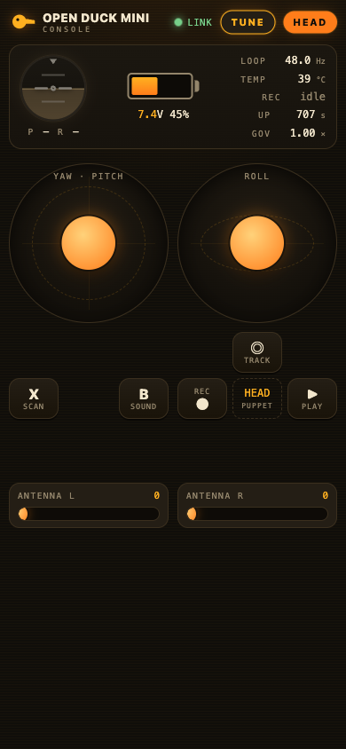

# What's New in Open Duck Supercharged v2.5

Everything this fork adds on top of the original
[apirrone/Open_Duck_Mini_Runtime](https://github.com/apirrone/Open_Duck_Mini_Runtime)
(branch `v2`). The upstream project gives you a walking BDX-style duck driven by an
imitation-RL policy; **Supercharged v2.5** makes it *walk more steadily*, adds a full
**phone control console**, and layers on a stack of quality-of-life features so a
newcomer can bring a duck up, tune it, and enjoy it without living in the terminal.

> Parts of v2.5 were co-developed with **[Claude Code](https://claude.com/claude-code)**
> (Anthropic's agentic coding tool), paired with on-robot testing on real hardware.

- [1. Rock-solid walking — stability](#1-rock-solid-walking--stability)
- [2. The phone control console (Web UI)](#2-the-phone-control-console-web-ui)
- [3. Live tuning from your phone](#3-live-tuning-from-your-phone)
- [4. Battery, camera & sensors](#4-battery-camera--sensors)
- [5. Expression & interaction](#5-expression--interaction)
- [6. Setup, deploy & ops tooling](#6-setup-deploy--ops-tooling)
- [7. Under the hood](#7-under-the-hood)
- [8. `duck_config.json` reference](#8-duck_configjson-reference)

---

## 1. Rock-solid walking — stability

The stock policy walks, but it can be twitchy and tip over on anything but a perfect
floor. v2.5 adds a set of **config-gated** stability levers — all **off by default**
(so behaviour is unchanged until you opt in), all tunable live from the phone, and all
seeded to a known-good baseline by `scripts/apply_stability_defaults.py`.

| Lever | What it does | Lower ↓ / Higher ↑ |
|---|---|---|
| **`action_scale`** | Scales the policy's residual around the standing pose (how far it swings the legs each step). | ↓ calmer, steadier · ↑ livelier, can get twitchy. **Ramped in smoothly** so a live change never jerks a servo. |
| **`velocity_clip`** + **`max_motor_velocity_rad_s`** | Clamps how far any joint may move in one control tick — a safety net against a policy spike snapping a servo. | On = smoother & safer. |
| **`stability_governor`** | A **near-fall safety layer**: when the duck starts tipping, it eases off your drive commands so it can recover in place instead of driving itself over. Fires *earlier* than the fall detector. | Tunable deadbands (tilt angle + tilt rate) and a floor speed. |
| **`phase_frequency_factor_offset`** | Nudges the gait cadence. | ↓ slower steps (steadier) · ↑ faster. Tune until the feet stop scuffing/stamping. |

**IMU mounting trim.** The policy balances on **raw gyro + accelerometer**, so any
mounting tilt reads as a permanent lean and biases the walk. v2.5 adds:

- A real **`imu_trim`** (pitch/roll) applied to accel + gyro on top of the axis remap.
- `scripts/imu_health_check.py` — a read-only tool that measures the residual mounting
  tilt, confirms gravity sits on +Z, checks gyro bias, and offers to save the trim.
- A **no-hang calibration** (`scripts/calibrate_imu.py`) that ignores the magnetometer
  (the motors disturb it and it never converges) and finishes as soon as gyro + accel
  are calibrated, saving to `~/imu_calib_data.pkl` in HOME so it loads from any cwd.
- **Live trim tuning** while walking — from the gamepad (**RB + D-pad**, **RB + Y** to
  save) or the phone's IMU-trim card — so you dial out a lean in real time.

**Fall detection → auto-pause.** `FallDetector` watches both foot switches; when the
duck goes over it **auto-pauses** the walk (and stops any playback), so it stops
flailing. Right the duck and press **A** (or Resume on the phone) to continue.

---

## 2. The phone control console (Web UI)

A **self-contained, dependency-free phone UI** served straight off the robot — no app,
no internet, no pairing. Join the duck's Wi-Fi and a warm amber "flight console" pops
up with a live **attitude horizon**, **battery**, loop rate, temperature, twin virtual
joysticks, and every button.

  
  &nbsp;
  

- **Two control paths at once.** The phone and the Xbox gamepad share one `ControlBus`
  — drive with either, swap mid-session freely. The gamepad hot-plugs in when you turn
  it on.
- **Captive portal.** Joining the duck's Wi-Fi **auto-opens** the console (iOS/Android/
  Windows connectivity probes are answered so the phone stays connected instead of
  dropping the network), and any `http://` URL you type forwards to it.
- **Zero dependencies.** A stdlib `ThreadingHTTPServer` on a daemon thread; the page is
  one self-contained HTML file. CPU cost is negligible next to the ONNX policy.
- **Live telemetry:** attitude that tilts with the IMU, battery %/voltage with a
  charging bolt, loop Hz, servo temperature, record state, governor activity, uptime,
  and a fallen/paused banner.

See [`docs/webui-api.md`](webui-api.md) for the HTTP contract. Preview it with no robot
attached via `mini_bdx_runtime/mini_bdx_runtime/webui/mock_server.py`.

---

## 3. Live tuning from your phone

Tap **TUNE** for a bottom-sheet panel that fits an iPhone and scrolls. **Everything is
live**, and nothing persists until you press **Save** — so you can experiment freely.

  

- **Walk tuning** — `action_scale`, gait offset, `velocity_clip`, max motor velocity,
  and the full stability governor, all as sliders/toggles.
- **Camera fine-tuning** (head-puppet) — exposure, gain, brightness, contrast,
  saturation, sharpness, AWB.
- **Ear antennas** — free-animation on/off and ear-sync on/off.
- **IMU trim** — nudge pitch/roll ± and Save, right on the main console.

Two touches that make it newcomer-friendly:

- **ⓘ Tap-to-explain hints.** Every control has a tappable **ⓘ** that reveals a short
  explanation of what it does and what lower-vs-higher values change — so you can tune
  without hunting docs.
- **↺ Reset to known-good defaults.** Walk tuning, IMU trim, camera, and antennas each
  have a reset button. The walk/IMU defaults are the reference duck's "steady as hell"
  values, defined once in `mini_bdx_runtime/walk_defaults.py` (the same values
  `apply_stability_defaults.py` seeds) — one tap recovers from any botched tweak.

---

## 4. Battery, camera & sensors

**Battery from the servos.** The Pi has no voltage sensor — but the Feetech STS3215
servos report their bus voltage and temperature. The control loop's `rustypot`
connection can't read those registers *and* opens the serial port exclusively, so v2.5
does a **safe bus handoff**: it momentarily releases `rustypot`, reads voltage + temp
through `pypot`, then **always** re-acquires `rustypot` (the servos simply hold their
last goal for ~0.2 s). It only fires when it's safe — **while the walk is paused** or
the **head-puppet is idle** — so it never disturbs a stride. Result: a real battery %
and servo temperature on the console. (Disable with `battery_servo_read: false`.)

**Live camera view + settings** (head-puppet). Tap **TUNE** to see a **live camera
feed** — confirm the camera actually works — and tune it for the room with exposure,
gain, brightness, contrast, saturation, sharpness and white-balance controls, saved to
`camera_controls`. The one on-board camera serves both face-tracking and the live view,
so there's never a second camera open.

  

---

## 5. Expression & interaction

- **Face tracking** (head-puppet, **D-pad ↑**). The head tracks the nearest face
  (picamera2 + OpenCV Haar, exposure-robust via `equalizeHist` so a backlit/dark face
  is still detected). Hold a face 1.5 s and the duck **greets** it (ear wiggle + happy
  sound, then a scanner "scan"); it chatters with random sounds + ear wiggles while
  tracking, and waves goodbye when you leave. With no face it replays your recorded
  idle.
- **Antenna jitter fix + free animation.** The ear servos jittered constantly under
  software PWM. v2.5 drives them from **pigpio hardware PWM** (see
  [`ops/pigpio/`](../ops/pigpio/)) — dead still unless commanded — configured
  `-t 0` so it stays off the **I2S speaker's clock** (a wrong timer can *damage* the
  speaker). With the jitter gone, a **scripted "free animation"** puts the life back on
  purpose: an organic random-wander idle wiggle you can switch off for precise hand
  control, plus an **ear-sync** toggle (unison vs. independent). *(Credit: antenna fix
  by Brad3D; I2S coexistence by Elpidiovaldez5.)*
- **Walk & head record / playback.** Hold **D-pad ←** 3 s to record everything you do
  (motion, antennas, sounds, projector), tap to stop; **D-pad →** loops it back. The
  walk records the whole **command stream** and plays it back *through the live policy*.
- **Scanner sound + droid voice.** A lamp-scanner sound loop coupled to the projector
  LED, and an off-robot **BD-1/BDX-style droid-voice generator** for making new sounds.

---

## 6. Setup, deploy & ops tooling

- **`scripts/first_time_setup.py`** — a one-command **guided bring-up wizard**
  (skippable, resumable): dependency check + `pip install -e .`, config creation, motor
  IDs, baseline PID, soft offsets, IMU calibrate + trim, walk-tuning seeding, expression
  features, Xbox reconnect, captive portal, and a final verification.
- **`transfer.command`** — one-shot **deploy**: scp every runtime file + ops kit to a
  duck (backing each up once on-device), and print an ordered bring-up checklist. Ideal
  for a second duck.
- **Ops kits** (one-time system setup on the Pi):
  - [`ops/pigpio/`](../ops/pigpio/) — antenna jitter fix (pigpio, I2S-safe `-t 0`).
  - [`ops/captive-portal/`](../ops/captive-portal/) — join-Wi-Fi-→-console portal.
  - [`ops/bluetooth/`](../ops/bluetooth/) — Xbox controller **auto-reconnect** kit
    (fixes the pad dropping after a few minutes and needing a reboot).
- **Docs.** A full **German operating manual**
  ([`docs/Bedienungsanleitung.md`](Bedienungsanleitung.md)) with every mode + gamepad
  map, plus the [Web UI API](webui-api.md) contract.

---

## 7. Under the hood

- **Pure-logic split + tests.** All the new decision logic (governor, fall detector,
  walk recorder, control bus, telemetry, IMU trim, antenna animation, face-tracker
  geometry, camera-control mapping, web routing…) is separated from hardware and covered
  by **19 standalone test files** that run off-robot with no Pi — `python3 test_*.py`.
- **Resilient input.** The Xbox reader survives an unplugged/re-plugged pad and merges
  the phone's inputs on the same code path.
- **Safety everywhere.** Played-back and authored motion is clamped **and** slew-rate
  limited; the live action_scale change is ramped; the battery handoff always
  re-acquires the bus in a `finally`.

---

## 8. `duck_config.json` reference

Per-robot settings live in `~/duck_config.json` (start from `example_config.json`).
Keys added by this fork, on top of the upstream `joints_offsets` /
`expression_features` / `imu_upside_down`:

| Key | Default | Meaning |
|---|---|---|
| `start_paused` | `false` | Boot the walk paused (unpause with **A**). |
| `imu_trim` | `{pitch:0, roll:0}` | IMU mounting-tilt correction (radians). |
| `action_scale` | *(policy default 0.25)* | Policy residual scale. |
| `velocity_clip` | `false` | Per-tick joint-move clamp. |
| `max_motor_velocity_rad_s` | `5.24` | Clamp limit when `velocity_clip` is on. |
| `stability_governor` | `{}` (off) | Tilt governor: `enabled`, `tilt_lo_deg`, `tilt_hi_deg`, `rate_lo`, `rate_hi`, `floor`, `smooth`. |
| `phase_frequency_factor_offset` | `0.0` | Gait cadence nudge. |
| `web_ui` / `web_port` | `true` / `8080` | Phone console on/off + port. |
| `battery` | `{}` | Pack mapping: `v_min`, `v_max`, `v_full` (2S-LiPo defaults). |
| `battery_servo_read` | `true` | Read pack voltage from the servos via the bus handoff. |
| `antenna_free_anim` | `true` | Scripted idle ear wiggle. |
| `antenna_sync` | `false` | Ears in unison vs. independent. |
| `camera_controls` | `{}` | Persisted libcamera controls (exposure, gain, …). |

> **Never copy one duck's `duck_config.json` onto another** — `joints_offsets` and
> `imu_trim` are that robot's mechanical zero. Seed the transferable walk tuning with
> `scripts/apply_stability_defaults.py`, then calibrate + trim each duck.
